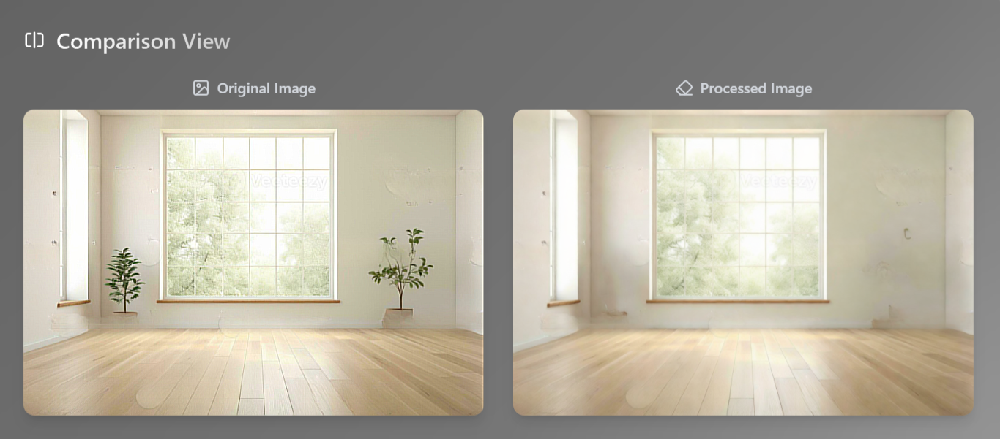

# Room Plant Removal Challenge

This project implements an AI-powered solution for automatically removing potted plants from interior room photos while maintaining the natural appearance of the space. Users can simply drag and drop their interior photos, and the AI will seamlessly remove any plants present.

## Demo

[Demo Video](https://drive.google.com/file/d/1U-2ddgDqzGwiu-9PLHEilWK1XDkGF9lw/view?usp=sharing)



## Technical Architecture

### Frontend
- **React** with **Tailwind CSS** (bolt.new template)
- Drag and drop interface for image upload
- Real-time preview of results

### Backend
- **Flask API** for efficient processing
- RESTful endpoints for image processing
- Base64 image encoding/decoding for seamless transfer

### Machine Learning Pipeline
1. **Plant Detection**: Detectron2 for precise plant identification
2. **Mask Generation**: Advanced segmentation with dilation
3. **Inpainting**: Multiple methods including:
   - Navier-Stokes (NS)
   - TELEA
   - Bilateral filtering
   - Multi-scale approach
4. **Final Processing**: Stable Diffusion for realistic context-aware filling

## Implementation Details

### Plant Detection and Segmentation
```python
def get_plant_mask(image, predictor, cfg):
    """Generate mask for plants using Detectron2."""
    outputs = predictor(image)
    
    # Identify plant-related classes
    plant_keywords = ["potted plant", "plant", "tree"]
    plant_class_ids = [i for i, cls in enumerate(coco_classes) 
                      if any(keyword in cls.lower() for keyword in plant_keywords)]
    
    # Generate and process mask
    if len(plant_indices) > 0:
        plant_mask = np.zeros(image.shape[:2], dtype=np.uint8)
        for i in plant_indices:
            mask = (pred_masks[i] * 255).astype(np.uint8)
            kernel = np.ones((15, 15), np.uint8)
            dilated_mask = cv2.dilate(mask, kernel, iterations=2)
            plant_mask = cv2.bitwise_or(plant_mask, dilated_mask)
        return plant_mask
```

### Inpainting Methods

#### 1. Multi-scale Approach
```python
def multi_scale_inpaint(image, mask):
    """Multi-scale inpainting for better results."""
    scales = [1.0, 0.8, 0.6, 0.4, 0.2]
    weights = [0.4, 0.25, 0.15, 0.12, 0.08]
    results = []
    
    for scale in scales:
        # Process at different scales
        scaled_size = (int(image.shape[1] * scale), int(image.shape[0] * scale))
        scaled_image = cv2.resize(image, scaled_size, interpolation=cv2.INTER_LANCZOS4)
        scaled_mask = cv2.resize(mask, scaled_size, interpolation=cv2.INTER_LINEAR)
        
        # Inpaint and refine
        result = cv2.inpaint(scaled_image, scaled_mask, 
                           inpaintRadius=int(15/scale), 
                           flags=cv2.INPAINT_NS)
        result = apply_bilateral_filter(result)
        
        results.append(result)
    
    # Blend results
    final_result = np.zeros_like(image, dtype=np.float32)
    for result, weight in zip(results, weights):
        final_result += result.astype(np.float32) * weight
    
    return apply_bilateral_filter(final_result.astype(np.uint8))
```

#### 2. Stable Diffusion Integration
```python
def gan_inpaint(image_data: str) -> dict:
    """Remove plants using Stable Diffusion inpainting."""
    try:
        # Decode and process image
        image = decode_image_data(image_data)
        mask = get_plant_mask(image)
        
        # Prepare for Stable Diffusion
        image_pil, mask_pil = prepare_images_for_inpainting(image, mask)
        
        # Run inpainting with context-aware prompts
        result = pipe(
            prompt="clean interior",
            negative_prompt="plants, trees, flowers, poor quality",
            image=image_pil,
            mask_image=mask_pil,
            num_inference_steps=20,
            guidance_scale=7.5
        ).images[0]
        
        return {
            "success": True,
            "processed_image": encode_result_image(result)
        }
    except Exception as e:
        return {"error": str(e)}
```

## Development Journey

### Initial Approach: Computer Vision
- Started with traditional CV techniques
- Used Detectron2 for plant segmentation
- Implemented basic inpainting methods (TELEA, NS)
- Applied image enhancement techniques:
  - Reduced inpainting radius
  - Edge preservation with bilateral filtering
  - Multi-scale processing

### Advanced Implementation: Stable Diffusion
- Transitioned to Stable Diffusion for better quality
- Integrated with Detectron2's precise masks
- Optimized for:
  - Resolution requirements (multiples of 8)
  - Context-aware filling
  - Natural texture generation

## Key Insights

1. **Traditional CV Limitations**
   - Basic inpainting struggles with complex textures
   - Edge preservation is challenging
   - Context understanding is limited

2. **AI Model Benefits**
   - Better understanding of room context
   - More natural texture generation
   - Superior handling of complex scenes

3. **Performance Considerations**
   - Mask quality is crucial for good results
   - GPU acceleration recommended for production
   - Trade-off between quality and processing time

## Installation and Usage

1. Clone the repository:
```bash
git clone [https://github.com/Sheltxn11/Remove-Objects-From-Images]
cd backend
```

2. Install dependencies:
```bash
pip install -r requirements.txt
```

3. Run the application:
```bash
python app.py
```

## Requirements

- Python 3.8+
- PyTorch
- OpenCV
- Detectron2
- Stable Diffusion
- Flask
- React (for frontend)


## Acknowledgments

- Detectron2 team
- Stable Diffusion community
- OpenCV contributors 
